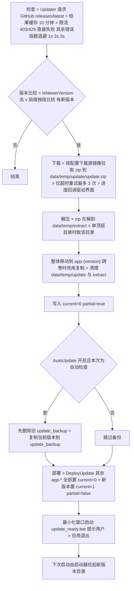

# 版本机制

> [!NOTE]
> 编写者：HelloGaoo 最后修改：2026/10/05

## 目录布局

```
PackageRoot/
  Glimpseon.exe           启动器
  app-x.y.z/              版本目录 每版本全量自含
    GlimpseonMain.exe     主程序
    record.json           版本元数据
  data/                   共享数据 与版本无关
    config log cache temp profile user icon wallpaper classphotos notes
  update_backup/          自动更新前对当前版本的完整备份
  update_ready.bat        更新部署后生成的提示脚本
```

## record.json

| 字段 | 含义 |
|---|---|
| current | 1 激活 0 停用 启动器与 Paths 只认 current=1 |
| partial | true 表示解压未完成部署 会被启动器与 Paths 跳过 |
| version | 版本号 Paths 读取后用于界面显示 |
| build_date | 构建日期 关于页显示 |
| files | 全量文件清单 相对路径 > hash(sha256 小写十六进制) + size(字节) 排除 record.json 自身 |
| variables.install_time | 写入时刻 yyyy-MM-ddTHH:mm:ss.fff |

生成入口 Record.CreateRecord 扫描版本目录逐文件哈希 另有 SaveRecord LoadRecord DeactivateVersion 负责读写与停用

## 启动器选择

Glimpseon.cs 扫描 app-* 目录 > 跳过缺 record.json partial=true 或解析失败的目录 > 按 current 降序 > 版本号 Major Minor Build 逐段降序 > 取首个启动 GlimpseonMain.exe > 注入 Glimpseon_PackageRoot 与 Glimpseon_AppDir 环境变量 > 等待退出并转发退出码

无候选目录或缺 GlimpseonMain.exe 时打印原因并以退出码 1 结束

主程序侧 Paths 优先读环境变量 缺失时按同一规则扫描 current=1 且 partial 不为 true 的目录 扫描失败或无命中时回退用包根目录 版本号读取失败按 1.0.0 处理

## 更新流水线



## 配置关联

| 配置项 | 默认 | 作用 |
|---|---|---|
| Other.AutoCheckUpdate | true | 启动时自动检查更新 |
| Other.AutoUpdate | false | 自动检查命中新版本后延迟 2 秒直接下载部署 |
| Download.Source | hk | 更新包下载镜像 |

## 回退

旧版本目录更新后保留 手动将目标目录 record.json 的 current 置 1 重启即切回 自动更新路径另有 update_backup 完整备份 需要时整体覆盖回对应版本目录再激活
