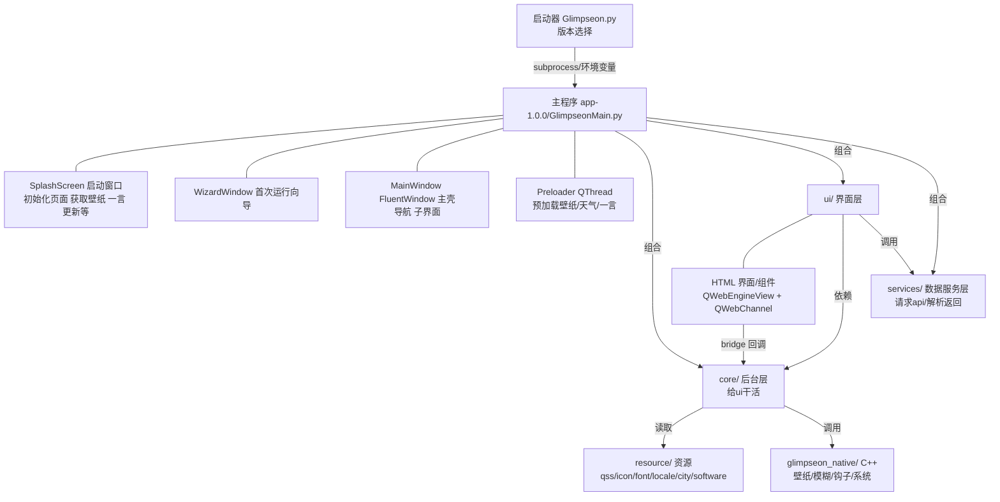

# 架构总览

> \[!NOTE]
> 编写者：HelloGaoo　最后修改：2026/09/12

## 1. 技术栈

| 层      | 技术                                        |
| ------ | ----------------------------------------- |
| 语言     | Python 3.11（主）、C++17                      |
| GUI 框架 | PyQt6 6.11                                |
| UI 组件库 | PyQt6-Fluent-Widgets 1.11                 |
| 无边框窗口  | PyQt6-Frameless-Window                    |
| HTML 渲染 | PyQt6-WebEngine                           |
| 原生绑定   | pybind11（`Glimpseon_native.pyd`）          |
| 配置     | qfluentwidgets `QConfig`（.json）           |
| 国际化    | `TranslationManager` + json              |
| 打包     | PyInstaller 6.20                          |
| 媒体/OCR | easyocr、pytesseract、opencv-headless、torch |
| 网络     | requests、aria2c（外部）、7z（外部）                |

完整依赖见 [requirements.txt](https://github.com/HelloGaoo/Glimpseon/blob/main/requirements.txt)。

## 2. 分层结构



## 3. 设计原则

1. **组件库**：UI 控件 PyQt6 Fluent Widgets；元素多的话 HTML性能来说更好一些，见 [ui-modules.md 11.4](ui-modules.md)
2. **路径**：目录由 [core/paths.py](https://github.com/HelloGaoo/Glimpseon/blob/main/app-1.0.0/core/paths.py) 在导入期处理（`get_resource_path()` 依次查 `APP_DIR → MEIPASS_DIR → APP_DIR`）
3. **配置**：配置项以 `ConfigItem` 形式声明在 [core/config.py](https://github.com/HelloGaoo/Glimpseon/blob/main/app-1.0.0/core/config.py) 的 `Config` 类中
4. **预加载/缓存**：壁纸 / 天气 / 一言在 `Preloader`（QThread）中同时拉取，`pyqtSignal` 回主线程刷新 ui
5. **跨语言**：高斯模糊（Direct2D）、空闲检测、单例互斥、图标提取等由 C++（`glimpseon_native`）处理

## 4. 数据处理（以壁纸为例）

壁纸在 `Preloader._load_wp()`（QThread）中预加载：读缓存（`get_cached_content`，过期也用旧的）→ 未命中则请求 API 落盘 → `_manageWallpaperLimit()` 控制数量 → `save_cache()` → `sig_wp.emit(path, src, url)` 回主线程。

主线程槽 `_upd_wp()` 依次：`QPixmap` 载入 → `_updateMainWindowBackground()` 设为主窗口背景 → `_applyEffects()` 模糊/亮度（调 `Glimpseon_native`）→ `infoCard.updateInfo()` 更新信息卡 → `historyManager.add()` 写入历史 → `wallpaperChanged.emit()` 通知主界面刷新。

完整时序见 [启动流程](launch-flow.md)。

## 5. 全局对象

| 对象                                       | 定义位置                                                                      | 作用          |
| ---------------------------------------- | ------------------------------------------------------------------------- | ----------- |
| `cfg`                                    | [core/config.py](https://github.com/HelloGaoo/Glimpseon/blob/main/app-1.0.0/core/config.py) | 全局配置单例      |
| `logger`                                 | [core/logger.py](https://github.com/HelloGaoo/Glimpseon/blob/main/app-1.0.0/core/logger.py) | 日志器         |
| `tr()`                                   | [core/utils.py](https://github.com/HelloGaoo/Glimpseon/blob/main/app-1.0.0/core/utils.py)   | 翻译查找函数      |
| `FUI`                                    | [core/utils.py](https://github.com/HelloGaoo/Glimpseon/blob/main/app-1.0.0/core/utils.py)   | Fluent 图标枚举 |
| `PACKAGE_ROOT` / `APP_DIR` / `DATA_ROOT` | [core/paths.py](https://github.com/HelloGaoo/Glimpseon/blob/main/app-1.0.0/core/paths.py)   | 路径常量        |

## 6. 外部联动

Glimpseon 可与以下外部系统集成（见 [core/linkage.py](https://github.com/HelloGaoo/Glimpseon/blob/main/app-1.0.0/core/linkage.py)）：

- **ClassIsland**：读取 `Profiles/Default.json` 与 `Settings.json`，同步课表 / 时间状态等
- **ClassWidgets**：同样读取类似档案

时间状态枚举 `TimeState`：`NONE / PREPARE_ON_CLASS / ON_CLASS / BREAKING / AFTER_SCHOOL`。

> \[!NOTE]
> 早期尝试过http 方式联动
>
> 稳定性原因最终直接找软件目录 读软件json配置

## 7. 数据目录

所有数据保存在 `PACKAGE_ROOT/data/`（见 [core/paths.py](https://github.com/HelloGaoo/Glimpseon/blob/main/app-1.0.0/core/paths.py)）：

```
data/
├── config/      config.json / Setup_Wizard.json / 课表 json
├── log/         日志
├── cache/       缓存
├── temp/        临时
├── profile/     课表
├── user/        数据
├── icon/        图标
├── wallpaper/   壁纸
├── classphotos/ 照片
└── notes/       便签
```

软件启动时调用 `ensure_data_dirs()`
