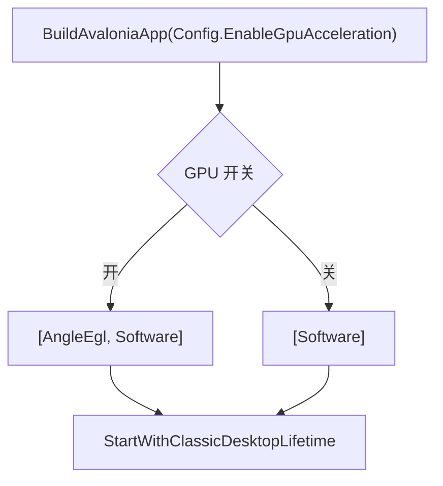
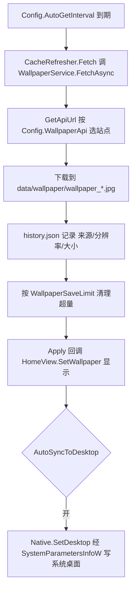

# 架构总览

> [!NOTE]
> 编写者：HelloGaoo 最后修改：2026/10/05

## 1 技术栈

| 层     | 选型                                                             |
| ----- | -------------------------------------------------------------- |
| 运行时   | .NET 10 net10.0-windows10.0.19041.0                            |
| UI 框架 | Avalonia 12 + FluentAvalonia + Avalonia.Themes.Fluent          |
| 渲染    | AngleEgl / Software (Win32PlatformOptions)                     |
| 数据    | System.Text.Json  Microsoft.Data.Sqlite                        |
| 系统交互  | P/Invoke (core/Win32) FlaUI UIA3 GSMTC (Windows.Media.Control) |
| 其他    | SharpCompress lunar-csharp Svg.Controls.Skia                   |

关键 NuGet 包: Avalonia 12.1.3 / FluentAvaloniaUI 3.1.0 / FlaUI.Core+UIA3 5.0.0 / SharpCompress 0.39.0 / Microsoft.Data.Sqlite 10.0.0 / lunar-csharp 1.6.8 / Svg.Controls.Skia.Avalonia / System.Drawing.Common

## 2 分层结构

```
Glimpseon.cs                  启动器 
app-1.0.0/
  GlimpseonMain.cs            Main
  core/                       
    AppConfig.cs              配置系统
    AppUtils.cs               工具
    Logging.cs                日志
    Paths.cs                  目录推导
    Constants.cs              资源常量
    Record.cs                 版本管理
    Timetable.cs              课表档案模型
    Linkage.cs                联动桥
    Downloader.cs             下载器
    Updater.cs                更新器
    Notifications.cs          通知
    ComponentModels.cs        组件系统
    Services/                
      Weather.cs              小米天气
      Wallpaper.cs            壁纸获取
      Media.cs                媒体系统
      Poetry.cs               一言
      Word.cs                 每日一词
      Sentence.cs             每日英语
      News.cs                 热榜
      History.cs              历史上的今天
      Almanac.cs              黄历农历
      DownloadCatalog.cs      下载器
    Win32/Native.cs           P/Invoke 封装
  ui/              
    App.axaml(.cs)            应用定义
    MainWindow                主窗口
    HomeView                  主界面
    Components.axaml.cs       组件系统
    WallpaperView             壁纸页
    TimetableView             课表页
    DownloadView              下载页
    NotificationView          通知页
    SettingsWindow            设置窗口
    WizardWindow              首次向导
    SplashWindow              启动窗口
    AboutView                 关于页
    DebugView                 调试页
    Common.cs                 公共对话框 主题色 工具
  locale/                     翻译
  Assets/                     资源
```

## 3 全局对象

| 对象                      | 位置                      | 职责    |
| ----------------------- | ----------------------- | ----- |
| Config                  | core/AppConfig.cs       | 全部配置项 |
| Paths                   | core/Paths.cs           | 路径推导  |
| Log                     | core/Logging.cs         | 日志    |
| AppUtils.CacheRefresher | core/AppUtils.cs        | 缓存    |
| MediaServices           | core/Services/Media.cs  | 媒体信息  |
| NotificationManager     | core/Notifications.cs   | 通知队列  |

## 4 渲染链与线程模型


```mermaid
flowchart TD
    A["BuildAvaloniaApp(Config.EnableGpuAcceleration)"] --> B{"GPU 开关"}
    B -->|"开"| C["[AngleEgl, Software]"]
    B -->|"关"| D["[Software]"]
    C --> E["StartWithClassicDesktopLifetime"]
    D --> E
```

| 执行流                  | 线程                      | 节奏      | 职责            |
| -------------------- | ----------------------- | ------- | ------------- |
| 界面渲染与事件              | Avalonia 主线程 Dispatcher | 帧驱动     | 布局 页面切换 组件画布  |
| CacheRefresher 循环    | 后台轮询循环                  | 步进 15s  | 到期更新缓存        |
| LinkageBridgeBase 轮询 | 独立后台线程                  | 5s      | 探测外部进程        |
| 通知动画                 | DispatcherTimer         | 16ms    | 滚动横幅与逐帧位移     |
| 壁纸预加载                | Task.WhenAny            | 0.6s 超时 | 超时转后台加载       |

## 5 数据处理示例 (壁纸)


```mermaid
flowchart TD
    A["Config.AutoGetInterval 到期"] --> B["CacheRefresher.Fetch 调 WallpaperService.FetchAsync"]
    B --> C["GetApiUrl 按 Config.WallpaperApi 选站点"]
    C --> D["下载到 data/wallpaper/wallpaper_*.jpg"]
    D --> E["history.json 记录 来源/分辨率/大小"]
    E --> F["按 WallpaperSaveLimit 清理超量"]
    F --> G["Apply 回调 HomeView.SetWallpaper 显示"]
    G --> H{"AutoSyncToDesktop"}
    H -->|"开"| I["Native.SetDesktop 经 SystemParametersInfoW 写系统桌面"]
```

<br />

## 6 外部联动

- ClassIsland > 进程定位 > 读课表 > 转换为 ScheduleRow
- ClassWidgets > 读 config/config.ini 与课程数据
- 桥接后台按 LinkagePollInterval 轮询 > ComputeState > Commit 抛 StateChanged
- 联动模式下课表页只读 ProfileSource 决定档案来源 (Glimpseon/classisland/classwidgets)

## 7 数据目录

```
PackageRoot/data/
  config/   
  log/   
  cache/
  temp/ 
  profile/  
  user/ 
  wallpaper/
  icon/ classphotos/ notes/
```

