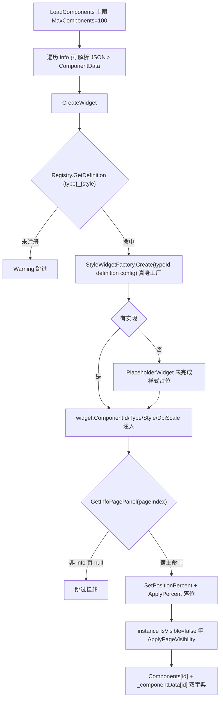
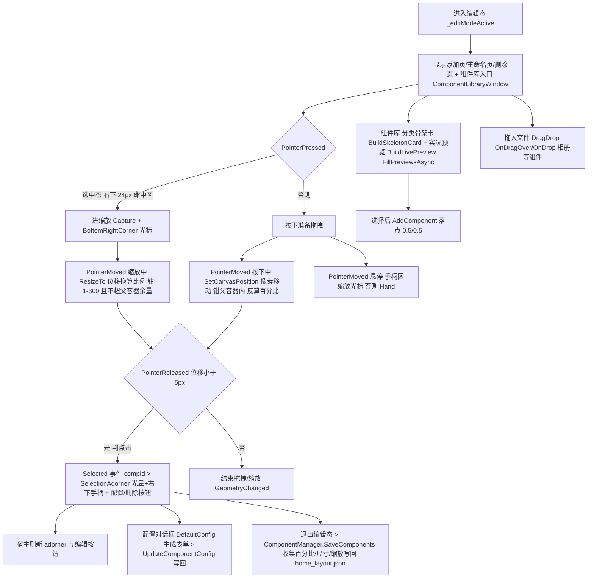

# 组件系统

> [!NOTE]
> 编写者：HelloGaoo 最后修改：2026/10/05

## 1 网格布局算法 (GridLayoutService)

- 输入 > 宿主宽高 + GridSettings { ShortSideCells 默认6 GapRatio 0.12 InsetPercent 默认5 }
- 短边定格子数 > 横屏行数=ShortSideCells 竖屏列数=ShortSideCells

```
edgeInset  = clamp(baseCell * InsetPercent/100  0  80)   baseCell = 短边/cells
available  = host - edgeInset*2
cellSize   = available短边 / (cells + (cells-1)*gapRatio)
gap        = cellSize * gapRatio
pitch      = cellSize + gap
另一边格数  = floor((available长边 + gap) / pitch)
GridWidthPx/HeightPx = n*cellSize + (n-1)*gap
```

- 宿主 <=1px 返回空 GridMetrics
- 输出 GridMetrics { ColumnCount RowCount CellSize GapPx EdgeInsetPx GridWidthPx GridHeightPx Pitch }
- 配置 Grid/ShortSideCells (6-96) 与 Grid/InsetPercent (0-30 经 CalculateEdgeInset clamp 0-30) 变更经 HomeView 订阅 UpdateGridMetrics 重建

## 2 组件定义 (ComponentDefinition)

| 字段                                     | 说明                                   |
| -------------------------------------- | ------------------------------------ |
| Id / DisplayName / Category / Icon     | 注册键 / 显示 / 分类 / 图标语义名                |
| MinWidthCells / MinHeightCells         | 最小格数 (默认 1)                          |
| DefaultWidthCells / DefaultHeightCells | 默认格数 (默认 2)                          |
| DefaultWidthPx / DefaultHeightPx       | 0 则按 cells\*110                      |
| DefaultWidth / DefaultHeight (计算属性)    | Px 优先 否则 Cells\*110                  |
| ResizeMode                             | Fixed / Horizontal / Vertical / Free |
| DefaultConfig                          | JsonElement? 组件默认配置                  |

## 3 内置组件

| Category | 中文名    | Id (样式后缀即 defId)              |
| -------- | ------ | ----------------------------- |
| Clock    | 数字时钟   | clock\_digital                |
| Clock    | 方形钟表I  | clock\_square\_1              |
| Clock    | 方形钟表II | clock\_square\_2              |
| Clock    | 月历     | clock\_calendar\_month        |
| Clock    | 简约月历   | clock\_calendar\_mini         |
| Clock    | 黄历     | clock\_almanac                |
| Clock    | 倒计时    | countdown\_event              |
| Clock    | 倒数日    | countdown\_days               |
| Clock    | 计时与倒计时 | timer\_countdown              |
| Weather  | 天气     | weather\_icon\_temp           |
| Weather  | 逐小时天气  | weather\_hourly               |
| Weather  | 逐日天气   | weather\_weekly               |
| Info     | 一言     | poetry\_one\_line             |
| Info     | 百度新闻   | news\_baidu                   |
| Info     | 微博新闻   | news\_weibo                   |
| Info     | 今日头条新闻 | news\_jinritoutiao            |
| Info     | 腾讯网新闻  | news\_tenxunwang              |
| Info     | 央视新闻   | news\_xcvts                   |
| Info     | 历史上的今天 | history\_today                |
| Info     | 每日单词   | word\_daily                   |
| Info     | 每日英语   | sentence\_daily               |
| School   | 班级卡片   | school\_info\_class\_info     |
| School   | 今日课表   | linkage\_timetable\_preview   |
| School   | 当前课程   | linkage\_timetable\_nowlesson |
| School   | 课程时间轴  | linkage\_timetable\_timeline  |
| School   | 横向相册   | class\_album\_horizontal      |
| School   | 纵向相册   | class\_album\_vertical        |
| School   | 作业板    | homework\_board               |
| School   | 公告栏    | announcement\_board           |
| Media    | 媒体播放器  | media\_player                 |
| Launcher | 快捷启动   | quick\_launch\_dock           |
| Launcher | 快捷启动II | quick\_launch\_grid           |
| Tools    | 计算器    | Math\_calculator              |
| Tools    | 书写板    | writing\_pad                  |
| Tools    | 便签     | sticky\_note                  |
| System   | 性能监测   | system\_performance           |
| System   | 网速监控   | system\_netspeed              |
| Study    | 分贝仪    | study\_meter                  |

- 带默认 config 的组件 > clock\_digital (show\_seconds/show\_lunar 默认 true) countdown\_event (target\_name/target\_date) countdown\_days (event\_name/target\_date/title\_bg\_color) weather\_icon\_temp (show\_icon) school\_info\_class\_info (school/class) linkage\_timetable\_nowlesson (show\_teacher/show\_next/show\_duration/show\_countdown/prepare\_minutes=3) media\_player (show\_progress) quick\_launch\_dock (icon\_size=64) quick\_launch\_grid (apps=\[]) sticky\_note (color=yellow)
- Def 快捷构造 > Def(id displayName category icon minW minH defW defH mode config wPx hPx)
- 查找键 = `{type}_{style}` 如 clock\_digital\_1 > Registry.GetDefinition

## 4 注册与实例数据

- ComponentRegistry > Dictionary<string ComponentDefinition> > RegisterBatch (空 Id 忽略 后注册覆盖) / GetDefinition / GetDefinitionsByCategory / GetCategories (排序去重) / Count
- 启动注入 > HomeView 构造中 RegisterBatch(BuiltinComponentDefinitions.All)
- 实例数据 (PageMeta.Components 内 JSON):

```json
{
  "id": "clock_digital_1",
  "type": "clock_digital",
  "style": "",
  "position": { "x": 0.5, "y": 0.3 },
  "size": { "w": 400, "h": 200 },
  "scale": 100,
  "enabled": true,
  "page_index": 0,
  "config": { "show_seconds": true, "show_lunar": true }
}
```

- 关键语义 > position x/y 是百分比 (0-1 相对页面可用区) 不是像素 > size 是像素 > scale 是百分比 (100=原大) 落库时已含用户缩放 > LoadComponents 缺省 position=0.5/0.5 size=220/220 scale=100 > style 字段必填 空则跳过该条

## 5 页面管理 (PageManager)

- 持久化 > data/config/home\_layout.json { current\_page pages\[] }
- PageMeta { Name Type components|items }
- 页面类型 > info (承载组件 Components 列表) / nav (导航页 items)
- 默认两页 信息页(info) + 导航页(nav) > MaxPages 10 > AddPage/Rename/Remove/Delete 即时 Save
- HomeView\.CreatePageWidget > nav 页生成 NavigationPage info 页生成 Canvas (SizeChanged 触发子项 ApplyPercent 重放)

## 6 实例化链路 (LoadComponents > CreateWidget)



- 配置热更新 UpdateComponentConfig > 写 Config > 记录旧位置/缩放 > 摘除旧容器 > CreateWidget  > AfterComponentRebuilt 回挂选中态 > SaveComponents

## 7 编辑模式交互



- 翻页 > GoToPage(index animate) \_pagesStack 平移动画 > PageIndicator 页码 > PointerWheel 也触发 (Tunnel)
- 页面切换后 ApplyPageVisibility > 组件只渲染当前页

## 8 组件私有持久化

| 组件                  | 路径                                                                      |
| ------------------- | ----------------------------------------------------------------------- |
| sticky\_note        | data/user/notes/{ComponentId}.json                                      |
| quick\_launch\_grid | data/user/qlgrid\_{ComponentId}.json (apps 数组 图标经 Native 提取存 data/icon) |
| homework\_board     | data/user/homework\_{ComponentId}.json                                  |
| class\_album\_\*    | data/classphotos/album\_{id}/                                           |
| countdown\_\*       | config 内嵌 (target\_name/target\_date)                                   |

## 9 课表数据供给 (TimetableScheduleProvider)

- GetTodaySchedule > 按 Config.ProfileSource 分发 > Glimpseon 本地档案解析 > classisland > LinkageBridge.GetTodaySchedule > classwidgets > ClassWidgetsBridge.GetTodaySchedule
- LatestProfileName / BuildTimelineNodes (时间线节点 现在课/课间渲染用)

## 10 扩展新组件步骤

1. ComponentModels.cs > All 数组追加 Def(id 显示名 分类 图标 尺寸约束 ResizeMode DefaultConfig)
2. Components.axaml.cs > StyleWidgetFactory.Create 加 `{type}_{style}` 分支返回 DraggableContainer 派生控件 > 继承 WidgetCardBase (ApplyTheme/BindOpacity 自动生效) > 未完成可暂用 PlaceholderWidget 占位
3. 数据读取 > 服务缓存 (GetCachedContent) 或组件私有文件 > 禁止直连 UI 外部状态
4. locale > 新文案补 zh\_CN/zh\_TW/en\_US 三份
5. 验证 > DebugMode 启动 > 编辑态添加 > 拖拽缩放 (缩放上限 300%) > 改配置 (确认重建后位置保留) > 重启确认 home\_layout.json 回读无丢失

