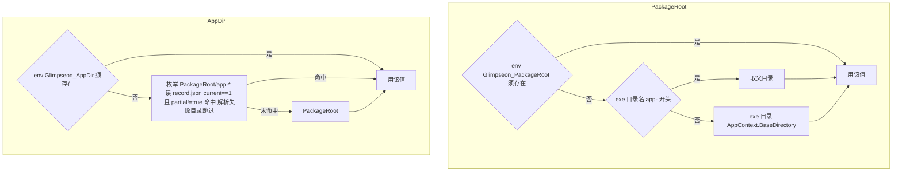
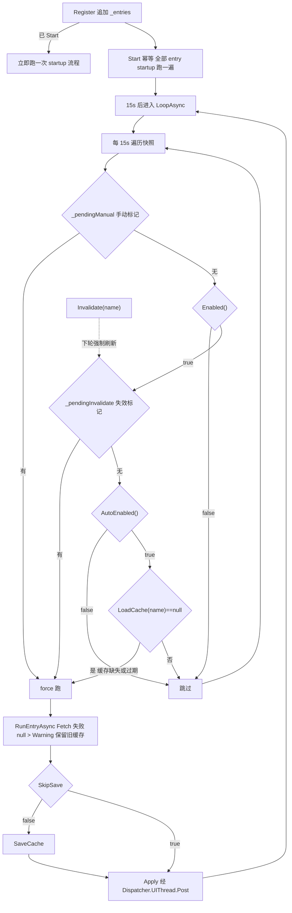
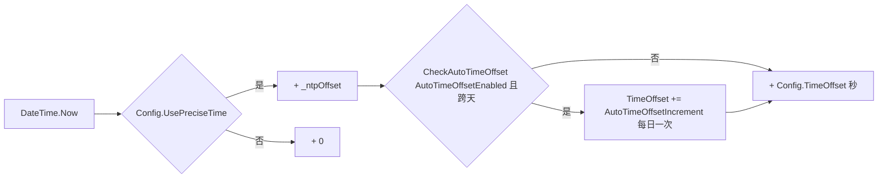
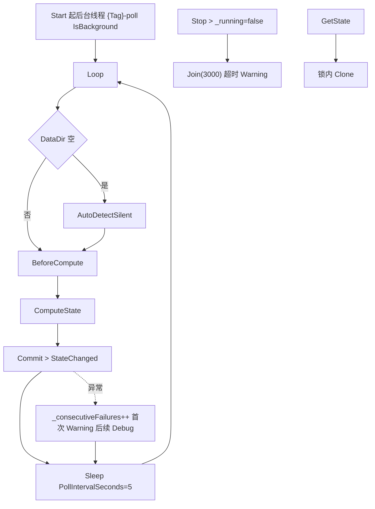
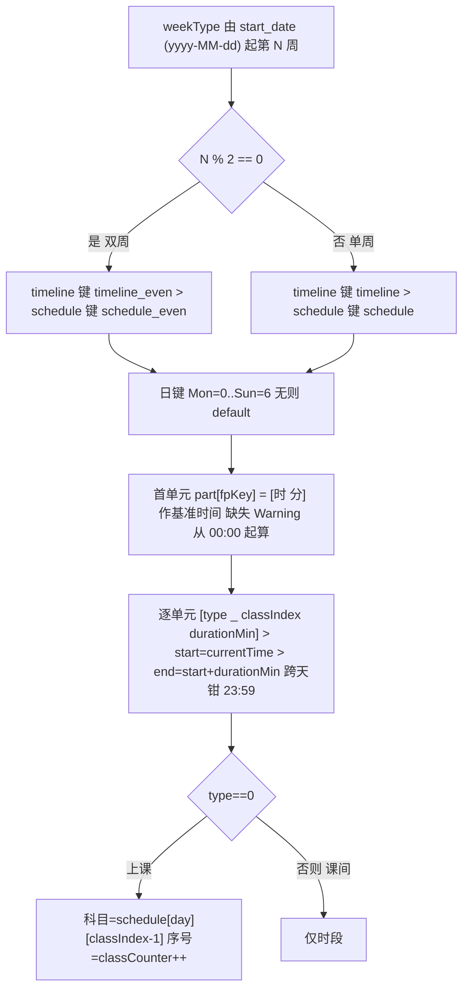
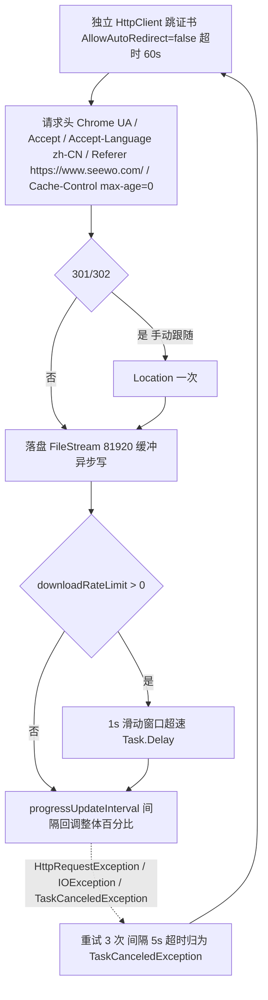
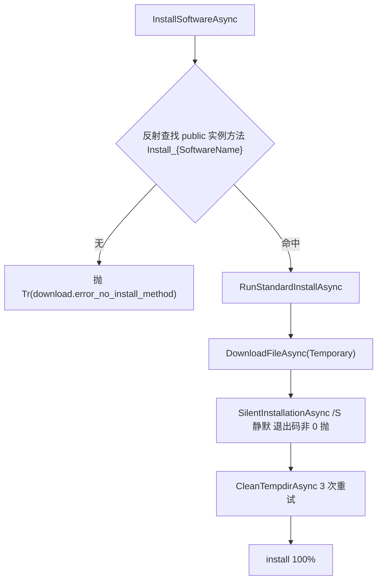
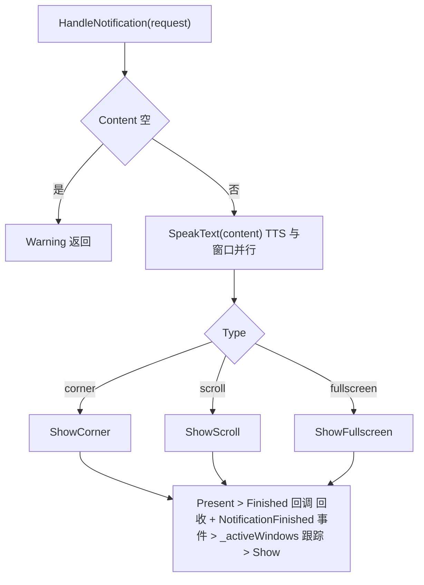
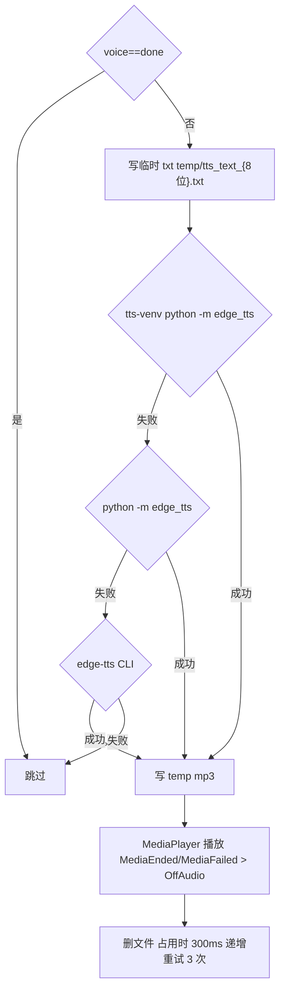

# 核心模块 (core/)

> [!NOTE]
> 编写者：HelloGaoo 最后修改：2026/10/05

## 1 AppConfig.cs — 配置管理

- ConfigItem<T> 声明即注册 (构造函数内 Config.Register) 字段 Group/Name/DefaultValue/RestartRequired
- 序列化器可自定义 (枚举>字符串 如 ThemeMode>light/dark/auto) 反序列化兼容 JsonElement 与字符串数字
- Clamp 写入校验 > min/max 截断 options 白名单越界回默认值并 Warning
- Value setter > 去重 > Log.Info > ValueChanged 事件 > Config.Save 全量重写 data/config/config.json (SaveLock 串行)
- SelfCheckRoundTrip > 用当前值/默认值/全部选项/布尔取反/边界数值做序列化往返比对 DebugMode 启动时全表执行

## 2 Paths.cs — 路径推导

推导链:



Version/BuildDate 读 AppDir/record.json 的 version/build\_date 失败 ("1.0.0" "")

路径属性全表 (在 PackageRoot/data 下):

| 属性              | 子目录         | 用途                                                   |
| --------------- | ----------- | ---------------------------------------------------- |
| DataRoot        | data        | 根                                                    |
| DataConfig      | config      | config.json / Setup\_Wizard.json / home\_layout.json |
| DataLog         | log         | app\_*.log crash\_*.log\*.zip                        |
| DataCache       | cache       | {name}.json 服务缓存                                     |
| DataTemp        | temp        | 下载临时 update.zip                                      |
| DataProfile     | profile     | 档案配置-N.json                                          |
| DataUser        | user        | announcements.json 组件私有数据                            |
| DataIcon        | icon        | 快捷启动组件图标                                             |
| DataWallpaper   | wallpaper   | wallpaper\_\*.jpg history.json                       |
| DataClassPhotos | classphotos | album\_{id}/                                         |
| DataNotes       | notes       | 便签数据                                                 |

- EnsureDataDirs > 11 个目录逐一存在性检查 CreateDirectory 失败仅 Warning 后续调用重试
- GetResourcePath(rel) > AppDir/rel (AppDir 已由启动器/环境变量保证正确)

## 3 Constants.cs — 常量

应用名 图标 课表来源 (Glimpseon/classisland/classwidgets) 资源路径 均为代码内字面量 以 Constants.cs 为准 不赘列

## 4 Logging.cs — 日志

- 级别 LogLevel > Debug/Info/Warning/Error Critical 输出名 CRITICAL 落 Error 级
- 行格式 `{PreciseNow:yyyy-MM-dd HH:mm:ss}|{LEVEL}|Glimpseon.{member}|{file}:{line}|{message}` 调用点经 CallerMemberName/CallerFilePath/CallerLineNumber 自动注入
- Configure(disableLog level maxCount maxDays) > maxCount 下限 10 maxDays 下限 30 > 文件名 app\_{启动时间戳}.log 落 DataLog
- 轮转 > 单文件超 1MB 改名 .1 旧 .1 删除
- CleanOldLogs > app\_*/crash\_* 的 .log/.zip 按修改时间降序 超 maxCount (默认 50) 删尾 超 maxDays (默认 30) 删除 > CompressOldLogs 超 24h 的 .log 压 .zip 删原件
- InitExceptionHooks > UnhandledException + UnobservedTaskException (SetObserved) > Critical 记录类型+消息+堆栈 启动期挂接一次

## 5 AppUtils.cs — 工具集

### 5.1 单实例

- Mutex 名 `Glimpseon_SingleInstance_Mutex_{A7F3E2D1-8B4C-4F6A-9D0E-1C2B3A4F5E6D}`
- VerifySingleInstance > AllowMultipleInstances 或 DebugMode 直接放行 > createdNew=false 时 WaitOne(0) AbandonedMutexException 按已获得所有权处理
- ReleaseSingleInstance > ReleaseMutex (非所属线程异常忽略) + Dispose

### 5.2 HTTP

- 共享 AppUtils.Http > 跳过证书校验 UA Chrome/120 超时 15s
- GetJsonAsync(url) > 异常 Log.Error 返回 null 服务层统一依赖此语义

### 5.3 翻译

- 语种 zh\_CN/zh\_TW/en\_US 文件 AppDir/locale/{code}.json > InitTranslation 展平嵌套对象 点号连接键
- Tr(key, args) > 未命中返回 key 本身 > {name} 占位插值
- Language Auto > DetectSystemLanguage > zh 系按 region (zh-HK/zh-TW/zh-MO > zh\_TW 其余 zh\_CN) > en > en\_US > 其他与检测异常 zh\_CN

### 5.4 缓存

- IntervalMap 两套写法等价 `never/5m/10m/15m/30m/1h/3h/6h/12h/24h/1d/3d/5d/7d` 与中文 `从不/5 分钟/.../7天` 未知值 Warning 按 never (0)
- SaveCache(name, content, interval="30分钟") 写 data/cache/{name}.json:

```json
{
  "content": { "...原始 JSON...": "" },
  "timestamp": 1759651200.123,
  "expires_at": 1759653000.123,
  "interval": "30分钟"
}
```

- interval=0 时 expires\_at 写 1e18 (永不过期判定阈值 1e17)
- LoadCache(name, ignoreExpiry) > 文件缺失/解析失败/过期返回 null
- GetCachedContent > LoadCache 后取 content 字段 Clone 返回

### 5.5 CacheRefresher (静态类)

Entry 字段:

| 字段          | 类型                         | 语义                               |
| ----------- | -------------------------- | -------------------------------- |
| Name        | required string            | 缓存 key 与轮询标识                     |
| Interval    | Func<string>               | SaveCache 间隔串                    |
| Enabled     | Func<bool>?                | 功能总开关 false 跳过                   |
| AutoEnabled | Func<bool>?                | 自动刷新开关 false 跳过 (手动刷新仍可)         |
| Fetch       | Func\<Task\<JsonElement?>> | 取数 失败 null                       |
| Apply       | Action\<JsonElement?>?     | UI 应用 经 Dispatcher.UIThread.Post |
| SkipSave    | bool                       | true 不落盘 (如直接取流数据)               |

生命周期:



- RunEntryAsync(startup=true) > Enabled 检查 > LoadCache(ignoreExpiry:true) 命中则直接 Apply (离线首屏) > 无缓存 Fetch 一次

### 5.6 自启动

- 注册表键 `HKCU\SOFTWARE\Microsoft\Windows\CurrentVersion\Run` 值名 Constants.AppName
- SetAutostart(enabled, delaySeconds=5) > 关 > DeleteValue > 开 > exe 优先 PackageRoot/Glimpseon.exe 否则 Environment.ProcessPath > delay>0 时经 cmd timeout 延迟启动并带 --autostart
- SyncAutostartCfg > 配置与注册表不一致时以配置写注册表 写失败回写 Config.AutoStart=实际值
- AutoStartLaunch > 命令行含 --autostart / /autostart

### 5.7 时间

- SyncNtp(server 默认 ntp.aliyun.com) > UDP 123 ReceiveTimeout 5s > offset 存 \_ntpOffset
- PreciseNow 构成:



### 5.8 字体

- HarmonyOS Sans 6 字重 (Thin/Light/Regular/Medium/Bold/Black) 位于 Assets/font/HarmonyOS\_Sans/
- InstallSystemFonts > 逐文件复制到 %WINDIR%/Fonts (已存在跳过) > 复制失败或源缺失走 Native.RegisterFontFile 会话级注册 > 有新注册则 WM\_FONTCHANGE 广播 (500ms 超时)

### 5.9 FUI 图标

- IconNameMap 语义名 > fluent 图标名 映射表以代码为准 > GetFluentIconPath(name, isDark) 取 Assets/fluent/{light|dark}/ 32 号缺失退 24 号

### 5.10 重启

- RequestRestart > Config.MarkRestartPending + IControlledApplicationLifetime.Shutdown > Main 尾部 RestartSelf 以 Environment.ProcessPath 拉起

## 6 Timetable.cs — 课表档案

档案文件 data/profile/{Name}.json:

```json
{
  "name": "档案配置-1",
  "defaultClassDuration": 40,
  "defaultBreakDuration": 10,
  "periods": [ { "type": "class", "start": "08:00", "end": "08:40" } ],
  "courses": { "0": { "周一": "语文" } }
}
```

- courses 键 = period 索引字符串 值结构由 UI 层约定 (周x>节次>科目)
- 语义要点 > Save 缺省按 Name 推路径 目录不存在则建 > Load 同名连续加载降级 Debug 日志 > RemovePeriod 后 courses 全量重排索引 越界 Warning > GetNextStartTime 末时段 end 否则 08:00 > ListProfiles 正则 `^档案配置-\d+\.json$` 按编号升序 > NextProfileName 现有 max+1 > EnsureDefaultProfile 空则建档案配置-1 否则取最新 > RenameProfile / DeleteProfile
- 第三方档案来源由 Config.ProfileSource 切换 联动开启时本地档案只读

## 7 Linkage.cs — 外部联动

### 7.1 状态模型

- TimeState > None(0)/PrepareOnClass(1)/OnClass(2)/Breaking(3)/AfterSchool(4) 中文映射 今天没有课程/准备上课/上课中/课间休息/放学
- LessonInfo { SubjectName TeacherName Initial StartTime EndTime Index }
- LinkageState 全字段 > CurrentSubject CurrentLesson NextLesson IsConnected LastUpdate OnClassLeft OnBreakingLeft CurrentIndex IsClassPlanLoaded > Clone() 深拷贝 (GetState 出口)
- ScheduleRow(Subject Teacher StartTime EndTime Index IsCurrent IsBreak BreakName) 课表视图行

### 7.2 LinkageBridgeBase 轮询骨架



- Commit(newState) > 换\_state 锁内比较 > StateChanged 每轮触发 > IsConnected 变化触发 ConnectedChanged 并 Log > TimeState 变化 (与 \_prevState 比较) 触发变更日志
- AutoDetectSilent > FindData 命中 > SetDataPath + SaveDetectedPath (写回 Config) 失败计数清零 > 未命中仅首次 Warning
- TryRedetect > 新路径且不同 > SetDataPath + SaveDetectedPath + ErrorOccurred("REDIRECT:{path}") 供上层重绑
- 重检测阈值 > ClassIsland 文件缺失 2 次 解析异常 3 次 ClassWidgets 数据空 2 次
- Stop > Join(3000) 超时 Warning > GetState 锁内 Clone

### 7.3 进程定位

- FindExeByProcessNames > Process.GetProcessesByName (去 .exe 后缀) MainModule.FileName 拿不到跳过
- ClassIsland > 进程 ClassIsland.Desktop.exe / ClassIsland.exe > exe 目录及其 data 子目录向上最多 3 层找 Profiles\Default.json > 固定候选 C:\ClassIsland2\data
- ClassWidgets > 进程 ClassWidgets.exe > exe 目录 config\config.ini > 固定候选 C:\ClassWidgets

### 7.4 LinkageBridge (ClassIsland)

- 数据文件 {DataDir}\Profiles\Default.json 设置文件 Settings.json > mtime 缓存 未变直接用 解析成功清失败计数
- ParseAll > Subjects>科目字典 / TimeLayouts 首个布局>时段槽 (TimeType 0=上课 其他=课间) / ClassPlans 按 TimeRule.WeekDay 分组 (IsEnabled!=true 跳过 取 SubjectId)
- SyncTimeConfig (BeforeCompute) > Settings.json mtime 变化时读 TimeOffsetSeconds>Config.TimeOffset IsTimeAutoAdjustEnabled>Config.AutoTimeOffsetEnabled TimeAutoAdjustSeconds>Config.AutoTimeOffsetIncrement
- ComputeState 判定:

```
LoadFileIfChanged 失败 > IsConnected=false
今日无 plan > TimeState=None
不在任何时段 (FindSlot 左闭右开) > 超末段 end > AfterSchool 否则 None
TimeType==0 > OnClass  否则 Breaking + CurrentSubject=BreakName
SlotToClassIndex > 统计 slotIdx 前 (含) 的上课段数-1 > CurrentLesson CurrentIndex
下一节 > SlotToClassIndex(offset=1) 查 NextLesson
剩余 > OnClassLeft / OnBreakingLeft = FmtDelta (h:mm:ss 或 mm:ss)
```

- 周键约定 > 内部 1=Mon..7=Sun 经 PythonWeekdayToDotnet 转换 (7>0) > 输出 ScheduleRow 上课行带科目教师 课程序号超当日计划截断 课间行 IsBreak=true BreakName 缺省 课间

### 7.5 ClassWidgetsBridge

- 数据目录含 config.ini + schedule/ 目录
- ResolveSchedulePath > config.ini (UTF-8 失败转 GBK) 读 `General|schedule` > schedule/{name} 或 {name}.json > 都没有取目录第一个 \*.json (OrderBy 文件名)
- ReadSchedule > 文件 mtime 缓存 换文件或变更才重读
- ParseSchedule 时间线模型 (顺序衔接):



- ComputeState 无数据计满 2 次 TryRedetect > 段内判定同 CI 桥 > 不在段内 > 超末段 AfterSchool 否则 Breaking(课间) 并向下一个上课段补 NextLesson + OnBreakingLeft
- GetScheduleByWeekday 键 Mon=0..Sun=6 (与 CI 桥不同) 按目标日重算单双周

## 8 Downloader.cs — 下载与安装 (Glimpseon.Core.Services 命名空间)

### 8.1 模型

- DownloadTask(SoftwareName Filename Url GithubPath PhaseAllocation=null)
- DownloadProgressInfo(SoftwareName Percent SpeedBytesPerSec DownloadedBytes TotalBytes)

### 8.2 镜像源 (DownloadSources)

| key        | locale 键                   | 前缀                                                |
| ---------- | -------------------------- | ------------------------------------------------- |
| original   | download.source\_github    | <https://github.com>                              |
| hk (默认)    | download.source\_hk        | <https://hk.gh-proxy.org/https://github.com>      |
| cloudflare | download.source\_cf        | <https://gh-proxy.org/https://github.com>         |
| edgeone    | download.source\_edgeone   | <https://edgeone.gh-proxy.org/https://github.com> |
| geekertao  | download.source\_geekertao | <https://ghfile.geekertao.top/https://github.com> |

- GetDownloadUrl > task.Url 直链优先 > GithubPath + 当前源前缀 > 都没有抛 Tr("download.error\_no\_url")

### 8.3 进度模型

- 阶段分配默认 download=70 decompress=20 install=10 (task.PhaseAllocation 可覆写)
- SetProgress > 只接受非回退值 (percent==0 或 >= last) > 10% 一档打日志 0/100 必打 > 外部回调异常只 Warning 一次
- ResetProgress > 清除单软件进度记忆

### 8.4 DownloadFileAsync

参数 > task downloadLocation("Temporary">DataTemp "Cache">DataCache) progressCallback completeCallback downloadRateLimit progressUpdateInterval=0.5



### 8.5 安装分发



- 特殊安装:

| 软件                  | 差异                                                |
| ------------------- | ------------------------------------------------- |
| 激活工具                | 7z 解压至 C:\Program Files (x86)\Seewo > 复制 lnk 到公用桌面 |
| 希沃壁纸                | 7z 解压至 C:\Windows\Web > img0.jpg 设为系统壁纸           |
| 省平台登录插件             | 直接运行 > 等 15s 进程出现 > KillProcess                   |
| 希沃品课小组端/教师端         | /S 静默 > 等目标进程出现 20s > 等退出 45s > Kill              |
| office2021          | 7z 解至 temp > setup.exe /configure config.xml      |
| ClassIsland2        | zip 解至 C:\ClassIsland2 > 建公用桌面快捷方式                |
| ClassWidgets        | zip 解至 C:\ClassWidgets > 建快捷方式                    |
| 其余                  | 标准流程 全清单见 DownloadCatalog.cs                      |

- 7z 解压带内置密码 (SevenZipPassword) SharpCompress 实现
- 失败统一 > SetProgress(name, 0) + 抛异常

## 9 Updater.cs — 自更新

检查 下载 解压 部署 回退与目录布局全链路见 Versioning.md 此处不重复

## 10 Record.cs — 版本记录

record.json 结构 生成 加载 停用语义见 Versioning.md 此处不重复

## 11 Notifications.cs — 通知

### 11.1 数据

- NotifType 常量 > scroll / corner / fullscreen
- NotificationRequest 字段与默认值:

| 字段                                | 默认                   | 说明                                  |
| --------------------------------- | -------------------- | ----------------------------------- |
| Type                              | ""                   | NotifType 之一                        |
| Content                           | ""                   | 正文                                  |
| Speed                             | 5                    | 滚动速度档 1-10 映射 30+(Speed-1)\*20 px/s |
| Duration                          | 5                    | 秒                                   |
| BgColor / BgAlpha                 | #000000 / 180        | 背景色与透明度                             |
| TextColor / FontSize / FontWeight | #ffffff / 24 / 1     | 字重 0=Normal 1=Bold 2=Black          |
| TtsVoice                          | zh-CN-XiaoxiaoNeural | "done" 表示禁用 TTS                     |
| TtsRate / TtsVolume               | 100 / 100            | 播报为 +N%/-N%                         |

- Announcements > data/user/announcements.json JsonArray \[{text created}] > Max=50 > Clean 清洗 (text 截 200 created 截 16 空文本丢弃) > Append 头部插入 同分钟同内容去重 > Changed 事件通知 UI

### 11.2 弹窗 (NotifPopupWindow 基类)

- 窗口属性 > SystemDecorations=None Topmost ShowInTaskbar=false ShowActivated=false 透明层
- Opened > Native.ForceTopmost + mouseThrough 时 Native.SetMouseThrough > Closed > Finished 回调
- WorkingArea > 主屏工作区 异常用 1920x1040

### 11.3 三种呈现

| 类型         | 实现                    | 关键行为                                                                        |
| ---------- | --------------------- | --------------------------------------------------------------------------- |
| Scroll     | ScrollBannerWindow    | 置工作区顶部下移 60px 高=Config.ScrollBannerBgHeight > 16ms Stopwatch 差分滚动 > 时长到且至少滚完 1 轮才 Close |
| Fullscreen | FullscreenPopupWindow | 覆盖工作区 居中换行文本 Duration 后 Close                                               |
| Corner     | WinRT Toast           | ToastText02 模板 标题 Glimpseon notifier id "Glimpseon" 需 Win10 (build>=10240)  |

### 11.4 NotificationManager



TTS 管线:



- 三通道依次为 {DataRoot}/tts-venv/Scripts/python.exe > 系统 python > edge-tts CLI
- 参数 > --voice {voice} --rate {+N%} --volume {+N%} -f {txt} --write-media {temp mp3}

## 12 Win32/Native.cs — P/Invoke (internal)

能力域 > 系统壁纸 (SystemParametersInfoW) 空闲毫秒 (GetLastInputInfo) 字体注册与 WM\_FONTCHANGE 广播 原生 MessageBox 进程内存读取 (OpenProcess/ReadProcessMemory 性能组件用) 窗口枚举与标题 强制置顶 鼠标穿透 (WS\_EX\_TRANSPARENT) > 成员清单以 Native.cs 为准
