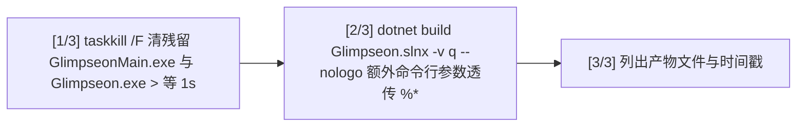

# 快速开始

> [!NOTE]
> 编写者：HelloGaoo 最后修改：2026/10/05

## 1 环境要求

- Windows 10 1809+ (SupportedOSPlatformVersion 10.0.17763.0)
- .NET SDK 10.x&#x20;

## 2 获取代码

```
git clone https://github.com/HelloGaoo/Glimpseon.git
```

## 3 工程与依赖

| 工程                             | 产物                | 要点                                                                |
| ------------------------------ | ----------------- | ----------------------------------------------------------------- |
| Glimpseon.csproj               | Glimpseon.exe     | 启动器 仅编译 Glimpseon.cs (EnableDefaultCompileItems=false) 零 NuGet 依赖 |
| app-1.0.0/GlimpseonMain.csproj | GlimpseonMain.exe | 主程序 OutputPath=.\ 产物落工程目录自身 携 app.manifest                        |

主工程关键属性

| 属性                         | 值                       | 用途                         |
| -------------------------- | ----------------------- | -------------------------- |
| ApplicationManifest        | app.manifest            | Windows 清单                 |
| BuiltInComInteropSupport   | true                    | GSMTC / UIA COM 互操作        |
| SatelliteResourceLanguages | en                      | 只保留英文附属资源 抑制多余语言目录         |
| AvaloniaResource           | Assets/font/\*\*/\*.ttf | 内嵌 HarmonyOS Sans 字体随程序集打包 |

主要 NuGet 包

| 包                                                    | 版本        | 用途                    |
| ---------------------------------------------------- | --------- | --------------------- |
| Avalonia / Avalonia.Desktop / Avalonia.Themes.Fluent | 12.1.3    | UI 框架 Fluent 主题       |
| FluentAvaloniaUI                                     | 3.1.0     | WinUI 风格控件 FAFrame 导航 |
| Svg.Controls.Skia.Avalonia                           | 12.0.0.17 | SVG 图标渲染              |
| ClassIsland.Markdown.Avalonia.Tight                  | 12.0.0    | Markdown 渲染           |
| SharpCompress                                        | 0.39.0    | 更新包与软件包解压             |
| Microsoft.Data.Sqlite                                | 10.0.0    | Assets/city.db 城市坐标查询 |
| FlaUI.Core / FlaUI.UIA3                              | 5.0.0     | UIA 进程定位 (联动桥)        |
| lunar-csharp                                         | 1.6.8     | 农历黄历本地计算              |
| System.Drawing.Common                                | 10.0.12   | GDI+ 图像处理             |
| System.Diagnostics.PerformanceCounter                | 10.0.0    | 性能计数器                 |

## 4 构建

```
build.bat
```

脚本三步



等价命令

```
dotnet build Glimpseon.slnx -v q
```

产物布局 (OutputPath=.\ 产物落各自工程目录)

```
Glimpseon.exe                  启动器
app-1.0.0/GlimpseonMain.exe    主程序
```

报错 MSB3021/MSB3027 文件锁定 > 应用仍在运行 > 关闭后重跑 build.bat

## 5 运行

- 方式 A 通过启动器 > 运行 Glimpseon.exe 由启动器按 record.json 选择版本目录并注入环境变量
- 方式 B 直接运行 > app-1.0.0/GlimpseonMain.exe 此时 PackageRoot 回退为 exe 所在目录 data 生成在 app-1.0.0/data 下 仅调试用

首次运行先弹出向导 (协议 > 基本设置 > 外观) 完成标记写入 data/config/Setup\_Wizard.json

## 6 调试

- 其他 > DebugMode 开启后 > 启动自检 Config.SelfCheckAll 序列化往返 日志压缩为 3 份 / 1 天
- 日志位于 data/log/ 格式 精确时间|级别|调用点|消息 级别由 Log/LogLevel 控制
- 命令行参数 --navtest > 启动后自动执行导航自测 window\.RunNavTestAsync
- 单实例锁 Glimpseon\_SingleInstance\_Mutex\_{A7F3E2D1-...} 残留导致无法启动时用任务管理器结束 GlimpseonMain.exe

## 7 常见问题

| 现象                 | 原因与处理                                                      |
| ------------------ | ---------------------------------------------------------- |
| 启动即弹已有实例提示         | 已有运行实例或锁未释放 AllowMultipleInstances 可放开限制                   |
| 壁纸不更新              | 查看 Wallpaper/AutoGetInterval 与 data/cache 内缓存过期时间          |
| 天气无数据              | City 无法定位>坐标回填失败 检查 data/log 中 \[PRELOAD] 记录               |
| 更新后仍跑旧版本           | 确认新目录 record.json current=1 partial=false 详见 Versioning.md |
| 启动异常弹原生 MessageBox | Native.ShowMessageBox 输出异常摘要 详情在 data/log/                 |

