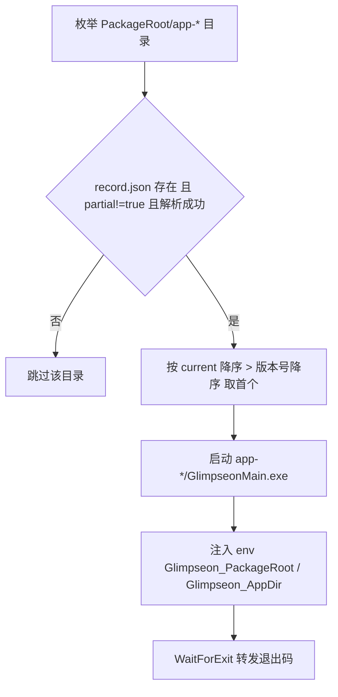
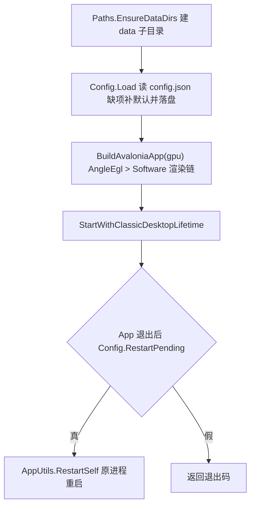
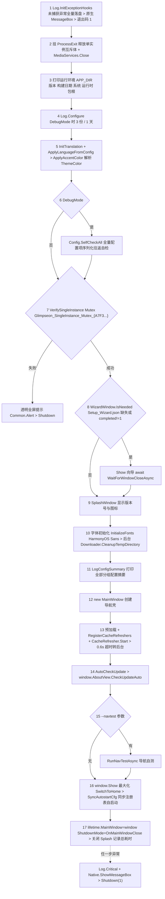
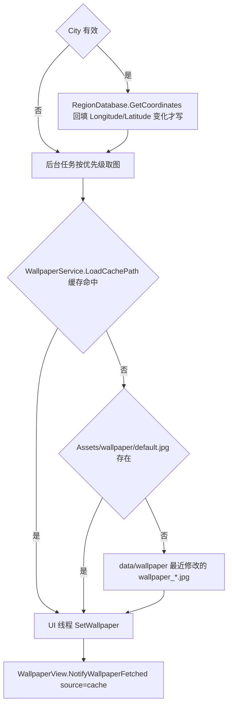
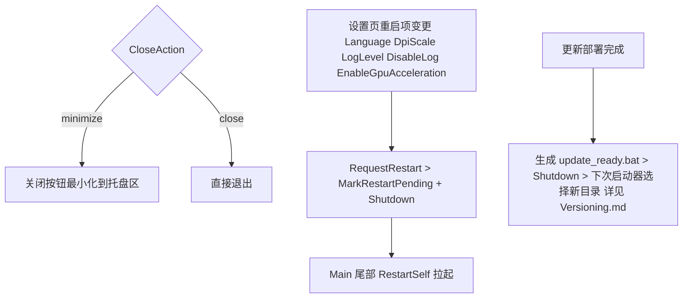

# 启动流程

> [!NOTE]
> 编写者：HelloGaoo 最后修改：2026/10/05

从双击 Glimpseon.exe 到主窗口显示的完整时序

## 阶段 0 启动器 (Glimpseon.cs Launcher.Main)

## 阶段 1 主程序入口 (GlimpseonMain.Main)

## 阶段 2 RunStartupAsync (App.OnFrameworkInitializationCompleted 调用)

## 预加载 (PreloadWallpaperAsync)

## 缓存刷新器 (RegisterCacheRefresher)

| Name | 间隔来源 | 开关 | Apply |
|---|---|---|---|
| weather | Weather/UpdateInterval | ShowWeather | 天气数据写缓存 |
| poetry | Poetry/UpdateInterval | ShowPoetry | 一言文本写缓存 |
| wallpaper | Wallpaper/AutoGetInterval | AutoGetInterval != never | SetWallpaper + 可选 SetDesktop (SkipSave 不写内容缓存) |

配置联动 City / UpdateInterval / ShowWeather / PoetryApiUrl / WallpaperApi / AutoGetInterval 任一 ValueChanged > CacheRefresher.Invalidate 对应项

## 阶段 3 退出与重启

