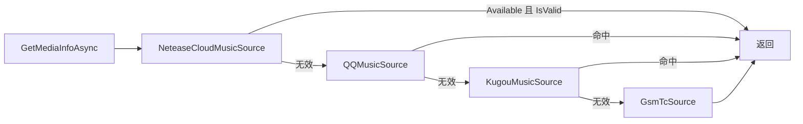

# 服务模块 (core/Services/)

> [!NOTE]
> 编写者：HelloGaoo 最后修改：2026/10/05

统一约定 > 服务层无 UI 依赖 > 拉取结果经 AppUtils.SaveCache 落 data/cache/{name}.json > 刷新节奏由 CacheRefresher 或组件定时器驱动 > 失败返回 null 并 Log 不抛出 > 缓存文件格式见 core-modules.md 5.4

## 1 Weather.cs — 天气

API 常量 (WeatherApi):

| 常量 | 值 |
|---|---|
| Url | https://weatherapi.market.xiaomi.com/wtr-v3/weather/all |
| AppKey | weather20151024 |
| Sign | zUFJoAR2ZVrDy1vF3D07 |

- 请求串 > `?appKey=..&sign=..&isGlobal=False&locale=zh_cn&latitude={lat}&longitude={lon}` > 经纬度未配置 (0) 时用北京默认坐标 39.9042/116.4074 并 Log.Info
- FetchAllAsync > 校验返回含 current 字段否则 null > 逐时/逐日模型类字段以 Weather.cs 为准
- ParseHourly(forecastHourly) > temperature.value[] 取前 24 小时 weather.value[i] 兼容 {day|night}/数组/标量三种形态 解析失败按 0 (晴)
- ParseDaily(forecastDaily) > 取前 15 天 温度兼容 {from,to}/{value}/数组 自动比较定 High/Low
- WeatherMaps 四张映射表:

| 表 | 作用 |
|---|---|
| IconMap | 天气代码 > Assets/icons/weather/{n}.svg 未知回 2.svg |
| TextMap | 代码 > locale 键 weather.* |
| CombinedTextMap | 21-28 复合天气 > 两键拼接 `A - B` |
| NightMap | 50-77 夜间代码 > 白天键 + `(夜间)` |

- GetWeatherText(code) 查表顺序 > TextMap > CombinedTextMap > NightMap > weather.unknown
- RegionDatabase (Assets/city.db Sqlite 表 regions) > Search 关键词模糊匹配 > GetCoordinates 未命中 (null null) > Weather/Source=city 时组件把城市名换经纬度写回 Config.Longitude/Latitude

## 2 Wallpaper.cs — 壁纸

### 2.1 站点表 (WallpaperService.GetApiUrl)

| Config.WallpaperApi | 请求地址 |
|---|---|
| wp.upx8.com (默认) | https://wp.upx8.com/api.php?content=风景 |
| api.ltyuanfang.cn | https://tu.ltyuanfang.cn/api/fengjing.php |
| imlcd.cn_bg_high | https://api.imlcd.cn/bg/high.php |
| imlcd.cn_bg_mc | https://api.imlcd.cn/bg/mc.php |
| imlcd.cn_bg_gq | https://api.imlcd.cn/bg/gq.php |

### 2.2 WallpaperService

- FetchAsync > 手动跟随重定向最多 5 跳 (301/302/307/308) > 响应字节非空校验 > 存 data/wallpaper/wallpaper_{yyyyMMdd_HHmmss}.jpg > SaveCacheFor (缓存 key=wallpaper content={path source url} 间隔=Config.AutoGetInterval) > History.SyncCleanup > History.Add
- LoadCachePath > GetCachedContent("wallpaper" ignoreExpiry:true) > path 字段文件存在才返回 (启动预取直读)
- SetDesktop(path) > 文件存在校验 > Native.SetDesktopWallpaper

### 2.3 WallpaperHistory (data/wallpaper/history.json)

```json
{
  "version": 1,
  "history": [
    { "id": "wallpaper_20260101_120000", "path": "...", "source": "wp.upx8.com",
      "api_url": "...", "added_time": "2026-01-01 12:00:00", "file_size": 1234567,
      "resolution": "1920x1080" }
  ]
}
```

- 版本不匹配 (HistoryVersion=1) 重置历史 > 构造时 ClearInvalid 清文件已失效记录
- Add > 同 id 记录移到首位 > 新记录分辨率经 Bitmap 解码 尺寸读取失败按 0 > 超过 MaxHistoryRecords=100 删尾
- Remove(id) / ClearInvalid / SyncCleanup(maxFiles=Config.WallpaperSaveLimit) > 只清 wallpaper_*.jpg 按 mtime 最旧先删 同步删记录

## 3 Poetry.cs — 一言

- GetPoetryAsync(apiUrl=Config.PoetryApiUrl) > GetStringAsync > 先按 JSON 解析 取 hitokoto + from/from_who 拼 `一言——来源` > 非 JSON 按原始文本
- GetPoetryWithCacheAsync > 缓存 key=poetry (存字符串) 命中直返 > 失败返回 Tr("poetry.default") 旧值保留语义

## 4 Word.cs — 每日单词

- 源 > https://uapis.cn/api/v1/daily/word?category=cet4 (WordCategory 固定 cet4)
- 校验 > words 数组非空且首项为对象 > 归一化 {date word: words[0]}
- 缓存 key=daily_word 间隔 12h

## 5 Sentence.cs — 每日英语

- 源 > https://api.timelessq.com/english-sentence
- 校验 > data.content 非空 > 归一化 {date sentence:{content note translation}}
- 缓存 key=daily_sentence 间隔 12h

## 6 News.cs — 新闻热榜

- 央视 > https://api.xcvts.cn/api/hotlist/ysxw?type=json > 取 data 或 news 数组 (根为数组直接用) > 缓存 key=news_cctv
- 多平台 > https://news.orz.ai/api/v1/dailynews/?platform={p} > 平台白名单 baidu/weibo/jinritoutiao/tenxunwang > data 数组或 status==200 (空列表) > 缓存 key=news_{platform}
- 统一间隔 30m (CacheInterval 常量) useCache=false 强制拉取

## 7 History.cs — 历史上的今天

- 源 > https://tmini.net/api/today?type=json
- 校验 > code==200 (数字或字符串) 且 events 数组 > 归一化 {date events}
- 缓存 key=history_today 间隔 12h

## 8 Almanac.cs — 黄历/农历 (纯本地 lunar-csharp)

- AlmanacData 字段 > Date LunarMonth(正月..腊月) LunarDay(初一..三十) YearGz/MonthGz/DayGz Zodiac SolarTerm Holiday Good[] Bad[]
- GetToday(day=null) > 按日期内存缓存 (Dictionary key=yyyy-MM-dd 当日复用) > Solar.FromYmdHms > 农历+干支+生肖+节气 > 节日合并 solar.Festivals + lunar.Festivals + lunar.OtherFestivals > 宜忌 lunar.DayYi/DayJi
- 无网络请求 失败缓存 null 并返回 null

## 9 Media.cs — 媒体信息 (最大模块)

### 9.1 数据模型

- MediaInfo > Title Artist Album TitleArtist ThumbnailData(byte[]?) PlaybackStatus(stopped/playing/paused) PositionMs DurationMs IsPlaying AppName SongId > IsValid 要求 Title/Artist/SongId 至少一项非空
- LyricLine(TimeMs Text) > Lyrics { Lines RawLrc SongId } > GetLineAtTime(ms) 倒序找 <= 时刻的行
- LrcParser.ParseLrc > 正则 `\[(\d{1,2}):(\d{1,2})(?:\.(\d{1,3}))?\]` 多时间标签展开 2 位厘秒 x10 1 位 x100 输出按时间排序

### 9.2 IMediaSource 接口

| 成员 | 语义 |
|---|---|
| Name / Available | 源标识 / 是否可尝试 |
| ReadAsync() | 读当前媒体 MediaInfo |
| LyricsAsync(media) | 歌词 (LRC 行) |
| CoverAsync(media) | 封面字节 |
| DurationAsync(media) | 时长补全 ms |
| ControlAsync(action) | 控制命令 (上一首/下一首等) |

### 9.3 NeteaseCloudMusicSource (优先级第一)

- 双通道取数:
  - 进程内存读取 > cloudmusic.exe > V2 按 V2Offsets 偏移表 V3 按 V3SchedulePattern/V3PlayerPattern 字节特征扫描 > Native.ProcessMemory (ReadF64/ReadU64/ReadI32) 读 SongId/播放时间/播放态 > 进程丢失自动重找 > 覆盖版本范围以偏移表为准
  - 窗口标题解析 > `标题 - 歌手`
- API 网关 https://music163.xuanmou.com.cn > /lyric?id= 取 lrc.lyric (空则 tlyric.lyric) > 歌曲详情补封面 URL 与时长 > LruCache(50) 缓存 lyric_{song_id}/cover_{song_id} > SemaphoreSlim(1,1) 串行化 API > 封面经 CoverUrl 直接下载
- 不支持 ControlAsync 恒 false

### 9.4 KugouMusicSource

- 数据来自窗口标题 (ParseWindowTitle) 无法获取真实进度/暂停态 > 恒 playing > 进度 = 曲目切换起经过秒 (Environment.TickCount64 基准) 超 0 则钳到时长
- 时长 > http://songsearch.kugou.com/song_search_v2?keyword=..&pagesize=1 取 Duration
- 歌词 > http://lyrics.kugou.com/search?keyword=..&duration=.. 取 candidates[0] 的 id+accesskey > /download?fmt=lrc&charset=utf8 > content base64 解码 <10 字符丢弃
- 封面 > 搜索结果 Image 替换 /{size} > Referer http://www.kugou.com/ > 体积校验 1KB-10MB
- 缓存字典 duration/lyric/cover 按 `Title - Artist` 键 进度按 1/10 档打日志降噪

### 9.5 QQMusicSource

- 歌词 > https://c.y.qq.com/lyric/fcgi-bin/fcg_query_lyric_y.fcg?keyword=.. (g_tk=5381 nobase64=0) Referer https://y.qq.com/
- 搜索 > https://c.y.qq.com/soso/fcgi-bin/client_search_cp?new_json=1&n=1&w=.. 同 Referer
- 缓存策略与酷狗同构 (标题键)

### 9.6 GsmTcSource

- Windows GSMTC > GlobalSystemMediaTransportControlsSessionManager.RequestAsync() > FindAllSessions 遍历系统任意播放器会话
- ReadAsync 取 Title/Artist/Thumbnail (MediaProperties) 进度/播放态 (SessionTimeline/PlaybackInfo)
- 全部媒体控制命令经此源 (MediaControlAsync/MediaNextAsync/MediaPrevAsync 直通 GsmTc)

### 9.7 MediaServices 路由



- 无效信息仅警告一次 (_invalidWarned)
- GetService(appName) > kugou/qqmusic|QQ音乐/netease|cloudmusic 关键词路由 > 精确名匹配 > 未匹配归 GsmTc
- Close() > 全源 Dispose (进程退出挂钩)

- 组件刷新间隔 Config.Media/UpdateInterval 默认 1s 由组件内定时器驱动

## 10 DownloadCatalog.cs — 软件下载目录 (静态清单)

- SoftwareEntry(名称 简介 图标 官网) + SoftwareCategory(NameKey 软件[]) + DownloadUrlEntry(Filename Url GithubPath)
- 分类 > download.cat_common (通用软件) / download.cat_seewo (希沃系) / 课表生态 (ClassIsland2 ClassWidgets) > 全清单以 DownloadCatalog.cs 为准
- 直链多为 seewo store/imlizhi-store 微信 QQ 网易云 UU 官方源 ClassWidgets 走 geekertao 镜像
- 图标取 Assets/ 下载执行在 core/Downloader (见 core-modules.md 8)

## 11 请求与缓存速查表

| 服务 | 缓存 key | 间隔 | 归一化输出 |
|---|---|---|---|
| Weather | weather (壁纸外的组件刷新走 CacheRefresher) | Config.Weather/Interval 默认 5m | 原始 JSON + Parse* 派生 |
| Wallpaper | wallpaper | Config.AutoGetInterval | {path source url} |
| Poetry | poetry | Config.PoetryUpdateInterval 默认 10m | 字符串 |
| Word | daily_word | 12h | {date word} |
| Sentence | daily_sentence | 12h | {date sentence{}} |
| News xcvts | news_cctv | 30m | 数组 |
| News orz.ai | news_{platform} | 30m | 数组 |
| History | history_today | 12h | {date events} |
| Almanac | 内存按日 | 当日 | AlmanacData |
